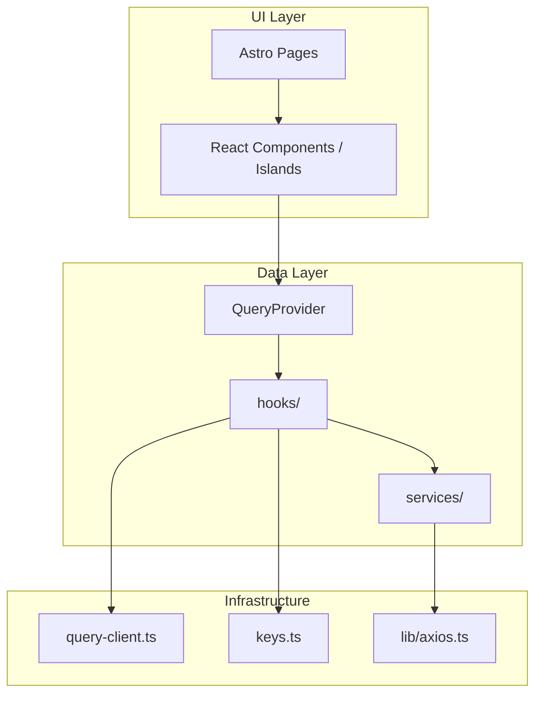

# Hooks Layer (TanStack Query)

Folder `hooks/` berisi **React hooks** berbasis [@tanstack/react-query](https://tanstack.com/query) untuk mengelola data server: fetching, caching, loading/error state, dan mutasi dengan invalidasi cache otomatis.

Hooks memanggil layer `services/` — **tidak** berkomunikasi langsung dengan axios atau API path.

## Posisi dalam Arsitektur



| Layer | Tanggung jawab |
|-------|----------------|
| Komponen React | UI, form, interaksi user |
| **`hooks/`** | Query/mutation, cache, refetch, invalidate |
| `services/` | HTTP calls ke backend |
| `plugins/QueryProvider.tsx` | Provider TanStack Query di tree React |

## Struktur File

```
hooks/
├── index.ts           # Barrel export
├── query-client.ts    # Konfigurasi & singleton QueryClient
├── keys.ts            # Query key factory per domain
├── auth.ts            # Mutations auth
├── user.ts            # Query & mutations user
├── blog.ts            # Query & mutations blog
├── gallery.ts         # Query & mutations gallery
├── work.ts            # Query & mutations work
├── pengurus.ts        # Query & mutations pengurus
└── upload.ts          # Query & mutations upload
```

Provider React ada di `plugins/QueryProvider.tsx` (bukan di folder hooks).

## Setup Provider

Setiap komponen React yang memakai hooks **harus** berada di dalam `QueryProvider`.

### Opsi 1: Wrap manual

```tsx
import QueryProvider from "../plugins/QueryProvider";
import BlogList from "./BlogList";

export default function BlogPageRoot() {
  return (
    <QueryProvider>
      <BlogList />
    </QueryProvider>
  );
}
```

### Opsi 2: HOC `withQueryProvider`

```tsx
import { withQueryProvider } from "../plugins/QueryProvider";
import { useBlogsQuery } from "../hooks";

function BlogList() {
  const { data, isLoading } = useBlogsQuery({ page: 1, limit: 10 });
  // ...
}

export default withQueryProvider(BlogList);
```

Di Astro, mount dengan `client:load`:

```astro
---
import BlogList from "../components/BlogList";
---
<BlogList client:load />
```

---

## query-client.ts

Konfigurasi global TanStack Query.

| Export | Kegunaan |
|--------|----------|
| `createQueryClient()` | Buat instance baru (default options) |
| `getQueryClient()` | Singleton di browser (hindari recreate saat HMR) |

Default options:

| Option | Nilai | Efek |
|--------|-------|------|
| `staleTime` | 60 detik | Data dianggap fresh, tidak refetch otomatis |
| `retry` (query) | 1 | Retry sekali jika gagal |
| `retry` (mutation) | 0 | Mutation tidak di-retry |
| `refetchOnWindowFocus` | `false` | Tidak refetch saat tab fokus |

---

## keys.ts

Centralized **query keys** untuk cache management dan invalidation.

```typescript
import { blogKeys } from "../hooks/keys";

queryClient.invalidateQueries({ queryKey: blogKeys.lists() });
```

| Export | Prefix key | Kegunaan |
|--------|------------|----------|
| `authKeys` | `["auth"]` | Auth (reserved) |
| `userKeys` | `["users"]` | User & profil |
| `blogKeys` | `["blogs"]` | Blog public & admin |
| `galleryKeys` | `["gallery"]` | Galeri |
| `workKeys` | `["works"]` | Works/proyek |
| `pengurusKeys` | `["pengurus"]` | Pengurus |
| `uploadKeys` | `["upload"]` | File upload |

Setiap domain punya helper seperti `list()`, `detail(id)`, dan namespace `admin` jika ada.

---

## Konvensi Penamaan Hook

| Pola | Tipe TanStack | Kegunaan |
|------|---------------|----------|
| `useXxxQuery` | `useQuery` | GET / baca data |
| `useXxxMutation` | `useMutation` | POST, PUT, DELETE |

Return value mengikuti API TanStack Query:

**Query:** `{ data, isLoading, isError, error, refetch, ... }`  
**Mutation:** `{ mutate, mutateAsync, isPending, isError, error, ... }`

---

## auth.ts

Semua operasi auth berupa **mutation** (tidak ada query cache session).

| Hook | Service |
|------|---------|
| `useLoginMutation` | `authService.login` — invalidate `userKeys.me()` |
| `useRegisterMutation` | `authService.register` |
| `useRefreshMutation` | `authService.refresh` |
| `useLogoutMutation` | `authService.logout` — `queryClient.clear()` |

```tsx
const login = useLoginMutation({
  onSuccess: () => router.push("/admin"),
});

login.mutate({ email, password });
```

---

## user.ts

| Hook | Tipe | Keterangan |
|------|------|------------|
| `useMeQuery` | Query | Profil user login |
| `useUsersQuery` | Query | List user |
| `useUserQuery` | Query | Detail user by ID |
| `useUpdateProfileMutation` | Mutation | Update profil → set cache `me` |
| `useChangePasswordMutation` | Mutation | Ganti password |
| `useCreateUserMutation` | Mutation | Buat user |
| `useUpdateUserMutation` | Mutation | Update user |
| `useDeleteUserMutation` | Mutation | Hapus user |
| `useSuperAdminsQuery` | Query | List super admin |
| `useCreateSuperAdminMutation` | Mutation | Buat super admin |
| `useAdminChangePasswordMutation` | Mutation | Admin ganti password user |

---

## blog.ts

| Hook | Tipe | Keterangan |
|------|------|------------|
| `useBlogsQuery` | Query | List blog public |
| `useBlogQuery` | Query | Detail blog |
| `useAdminBlogsQuery` | Query | List blog admin |
| `useAdminBlogQuery` | Query | Detail blog admin |
| `useCreateBlogMutation` | Mutation | Buat blog + files |
| `useUpdateBlogMutation` | Mutation | Update blog |
| `useDeleteBlogMutation` | Mutation | Hapus blog |

Mutation create/update menerima object:

```typescript
{ payload: CreateBlogPayload; files?: File[] }
{ id: string | number; payload: UpdateBlogPayload; files?: File[] }
```

---

## gallery.ts

| Hook | Tipe | Keterangan |
|------|------|------------|
| `useGalleryQuery` | Query | List galeri |
| `useCreateGalleryMutation` | Mutation | Upload galeri |
| `useDeleteGalleryMutation` | Mutation | Hapus galeri |

---

## work.ts

| Hook | Tipe | Keterangan |
|------|------|------------|
| `useWorksByProjectTypeQuery` | Query | Works by project type |
| `useAdminWorksQuery` | Query | List works admin |
| `useAdminWorkQuery` | Query | Detail work |
| `useCreateWorkMutation` | Mutation | Buat work |
| `useUpdateWorkMutation` | Mutation | Update work |
| `useDeleteWorkMutation` | Mutation | Hapus work |

---

## pengurus.ts

| Hook | Tipe | Keterangan |
|------|------|------------|
| `usePengurusByDivisionQuery` | Query | Pengurus per divisi |
| `usePengurusProfileQuery` | Query | Profil pengurus login |
| `useAdminPengurusListQuery` | Query | List pengurus admin |
| `useAdminPengurusQuery` | Query | Detail pengurus |
| `useAdminPengurusByUserQuery` | Query | Pengurus by user ID |
| `useCreatePengurusProfileMutation` | Mutation | Buat profil sendiri |
| `useUpdatePengurusMeMutation` | Mutation | Update profil sendiri |
| `useDeletePengurusMeMutation` | Mutation | Hapus profil sendiri |
| `useCreateAdminPengurusMutation` | Mutation | Admin buat pengurus |
| `useUpdateAdminPengurusMutation` | Mutation | Admin update pengurus |
| `useDeleteAdminPengurusMutation` | Mutation | Admin hapus pengurus |

---

## upload.ts

| Hook | Tipe | Keterangan |
|------|------|------------|
| `useUploadFilesQuery` | Query | List file per kategori |
| `useDeleteUploadFileMutation` | Mutation | Hapus file |

Kategori valid: `"gallery" | "blog" | "work" | "pengurus"`.

---

## Cache Invalidation

Setiap mutation otomatis menginvalidate atau mengupdate cache yang relevan:

| Aksi | Perilaku cache |
|------|----------------|
| Create | `invalidateQueries` pada list terkait |
| Update | `setQueryData` pada detail + invalidate list |
| Delete | `removeQueries` pada detail + invalidate list |
| Login | Invalidate `userKeys.me()` |
| Logout | `queryClient.clear()` — hapus semua cache |

Override perilaku default lewat opsi TanStack di hook:

```tsx
const createBlog = useCreateBlogMutation({
  onSuccess: (data) => {
    toast.success(parseApiMessage(data, true));
  },
  onError: (error) => {
    toast.error(parseApiError(error));
  },
});
```

Pesan error/success human-readable tersedia di `lib/message.ts`.

---

## Contoh Lengkap di Komponen

```tsx
import { withQueryProvider } from "../plugins/QueryProvider";
import { useAdminBlogsQuery, useDeleteBlogMutation } from "../hooks";
import { parseApiError } from "../lib/message";

function AdminBlogTable() {
  const { data, isLoading, isError, error } = useAdminBlogsQuery({
    page: 1,
    limit: 20,
  });

  const deleteBlog = useDeleteBlogMutation();

  if (isLoading) return <p>Memuat...</p>;
  if (isError) return <p>{parseApiError(error)}</p>;

  return (
    <ul>
      {data?.blogs?.map((blog) => (
        <li key={blog.id}>
          {blog.title}
          <button
            type="button"
            onClick={() => deleteBlog.mutate(blog.id)}
            disabled={deleteBlog.isPending}
          >
            Hapus
          </button>
        </li>
      ))}
    </ul>
  );
}

export default withQueryProvider(AdminBlogTable);
```

---

## Cara Import

```typescript
import {
  useBlogsQuery,
  useLoginMutation,
  blogKeys,
  getQueryClient,
} from "../hooks";
```

---

## Menambah Hook Baru

1. Pastikan service sudah ada di `services/`
2. Tambah query keys di `keys.ts`
3. Buat `useXxxQuery` / `useXxxMutation` di `{domain}.ts`
4. Export dari `index.ts`
5. Wrap komponen dengan `QueryProvider` atau `withQueryProvider`

Checklist mutation:

- [ ] Panggil method service di `mutationFn`
- [ ] Invalidate/set cache yang terdampak di `onSuccess`
- [ ] Terima optional `UseMutationOptions` untuk custom handler di komponen

Checklist query:

- [ ] Gunakan key dari `keys.ts`
- [ ] Set `enabled` jika bergantung pada parameter (mis. `id` kosong)
- [ ] Terima optional `UseQueryOptions` untuk override di komponen

---

## Hubungan dengan Folder Lain

| Folder | Relasi ke hooks |
|--------|-----------------|
| `services/` | Dipanggil sebagai `queryFn` / `mutationFn` |
| `lib/types/` | Type data query & mutation |
| `lib/message.ts` | Pesan error/success untuk UI |
| `plugins/QueryProvider.tsx` | Provider wajib untuk hooks |

**Jangan** panggil service langsung dari komponen jika data perlu di-cache, di-share antar komponen, atau butuh loading state — gunakan hooks.
