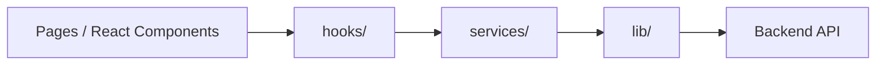

# Services Layer

Folder `services/` berisi **API client layer** untuk frontend DOSCOM. Setiap file mewakili satu domain backend dan bertanggung jawab **hanya** untuk memanggil HTTP API — tanpa state React, tanpa caching, tanpa UI logic.

## Posisi dalam Arsitektur



| Layer | Tanggung jawab |
|-------|----------------|
| `pages/` / komponen React | Render UI, event handler, navigasi |
| `hooks/` | State server (TanStack Query), cache, loading/error |
| **`services/`** | Request HTTP ke backend per domain |
| `lib/` | Infrastruktur: axios, path, types, helpers, messages |

**Aturan:** Komponen sebaiknya **tidak** memanggil `axios` atau `fetch` langsung. Gunakan hooks di `hooks/`; hooks memanggil services di sini.

## Struktur File

```
services/
├── index.ts              # Barrel export semua service + types
├── auth.service.ts       # Login, register, refresh, logout
├── user.service.ts       # Profil & manajemen user
├── blog.service.ts       # Blog public & admin
├── gallery.service.ts    # Galeri public & admin
├── work.service.ts       # Proyek/works public & admin
├── pengurus.service.ts   # Pengurus public & admin
└── upload.service.ts     # File upload (MinIO)
```

Types domain ada di `lib/types/`, bukan di folder ini (kecuali payload/query khusus service yang diekspor dari file service).

## Dependensi yang Dipakai

Setiap service menggunakan utilitas dari `lib/`:

| Modul | Kegunaan |
|-------|----------|
| `lib/axios.ts` | Instance axios + interceptor auth & error |
| `lib/api-path.ts` | Semua path endpoint (`API_PATH`) |
| `lib/func/http.ts` | Helper envelope API, `toFormData` |
| `lib/func/auth.ts` | Simpan/hapus access token (auth) |
| `lib/func/blog.ts` | Normalisasi response blog |
| `lib/func/work.ts` | Builder FormData work |
| `lib/types/` | Interface request/response |

Path API relatif terhadap base URL axios: `/api/v1`.

## Cara Import

```typescript
import { authService, blogService, type CreateBlogPayload } from "../services";
```

Atau import langsung per file:

```typescript
import { userService } from "../services/user.service";
```

---

## auth.service.ts

Autentikasi JWT. Endpoint auth **tidak** memakai envelope `{ success, message, data }` — respons langsung JSON.

| Method | HTTP | Keterangan |
|--------|------|------------|
| `login(payload)` | POST `/auth/login` | Login, simpan access token ke localStorage |
| `register(payload)` | POST `/auth/register` | Registrasi user baru |
| `refresh()` | POST `/auth/refresh` | Perbarui access token (butuh cookie refresh) |
| `logout()` | POST `/auth/logout` | Logout & hapus access token |

---

## user.service.ts

Manajemen user & profil (envelope API).

| Method | Keterangan |
|--------|------------|
| `getMe()` | Data user yang sedang login |
| `updateProfile(payload)` | Update profil sendiri |
| `changePassword(payload)` | Ganti password sendiri |
| `list(params?)` | Daftar user (pagination) |
| `getById(id)` | Detail user by ID |
| `create(payload)` | Buat user |
| `update(id, payload)` | Update user |
| `remove(id)` | Hapus user |
| `admin.listSuperAdmin()` | Daftar super admin |
| `admin.createSuperAdmin(payload)` | Buat super admin |
| `admin.changePassword(id, payload)` | Ganti password user (admin) |

---

## blog.service.ts

Blog artikel — public read, admin CRUD dengan multipart/form-data untuk gambar.

**Query types:** `PublicBlogQuery`, `AdminBlogQuery`  
**Payload types:** `CreateBlogPayload`, `UpdateBlogPayload`

| Method | Keterangan |
|--------|------------|
| `list(params?)` | List blog public |
| `getById(id)` | Detail blog |
| `admin.list(params?)` | List blog (admin) |
| `admin.getById(id)` | Detail blog (admin) |
| `admin.create(payload, files?)` | Buat blog + upload gambar |
| `admin.update(id, payload, files?)` | Update blog |
| `admin.remove(id)` | Hapus blog |

---

## gallery.service.ts

Galeri foto kegiatan.

**Query type:** `GalleryQuery`  
**Payload type:** `CreateGalleryPayload`

| Method | Keterangan |
|--------|------------|
| `list(params?)` | List galeri (filter tahun optional) |
| `admin.create(payload, files)` | Upload galeri (max 5 file) |
| `admin.remove(id)` | Hapus galeri |

---

## work.service.ts

Proyek/portfolio works.

**Query type:** `PublicWorkQuery`  
**Payload types:** `CreateWorkPayload`, `UpdateWorkPayload`

| Method | Keterangan |
|--------|------------|
| `listByProjectType(projectType, params?)` | List works by tipe proyek |
| `admin.list(params?)` | List semua works (admin) |
| `admin.getById(id)` | Detail work |
| `admin.create(payload, files?)` | Buat work + gambar |
| `admin.update(id, payload, files?)` | Update work |
| `admin.remove(id)` | Hapus work |

---

## pengurus.service.ts

Data pengurus/divisi.

**Payload types:** `CreatePengurusPayload`, `UpdatePengurusPayload`

| Method | Keterangan |
|--------|------------|
| `listByDivision(division)` | List pengurus per divisi (public) |
| `getProfile()` | Profil pengurus user login |
| `createProfile(payload, file?)` | Buat profil pengurus |
| `updateMe(payload, file?)` | Update profil sendiri |
| `deleteMe()` | Hapus profil sendiri |
| `admin.list(divisi?)` | List pengurus (admin) |
| `admin.getById(id)` | Detail pengurus |
| `admin.getByUserId(userId)` | Pengurus by user ID |
| `admin.create(payload, file?)` | Buat pengurus |
| `admin.update(id, payload, file?)` | Update pengurus |
| `admin.remove(id)` | Hapus pengurus |

---

## upload.service.ts

Manajemen file di MinIO.

| Method | Keterangan |
|--------|------------|
| `listFiles(params)` | List file per kategori (`gallery`, `blog`, `work`, `pengurus`) |
| `deleteFile(payload)` | Hapus file by nama |

---

## Error Handling

Error HTTP ditangani otomatis di `lib/axios.ts` via interceptor:

- Respons error diterjemahkan ke pesan human-readable (`lib/message.ts`)
- Dilempar sebagai `ApiError` dengan `message`, `status`, dan `rawMessage`

Service **tidak** perlu try/catch khusus kecuali ada logic bisnis tambahan.

## Contoh Penggunaan Langsung (Tanpa Hooks)

Gunakan hanya jika memang tidak butuh React Query (misalnya script one-off):

```typescript
import { blogService } from "../services";

const response = await blogService.list({ page: 1, limit: 10 });
```

Untuk komponen React/Astro islands, **selalu prefer hooks** di `../hooks/`.

## Menambah Service Baru

1. Tambah path di `lib/api-path.ts`
2. Tambah types di `lib/types/`
3. Buat `{domain}.service.ts` di folder ini
4. Export dari `index.ts`
5. Buat hooks terkait di `hooks/{domain}.ts`
